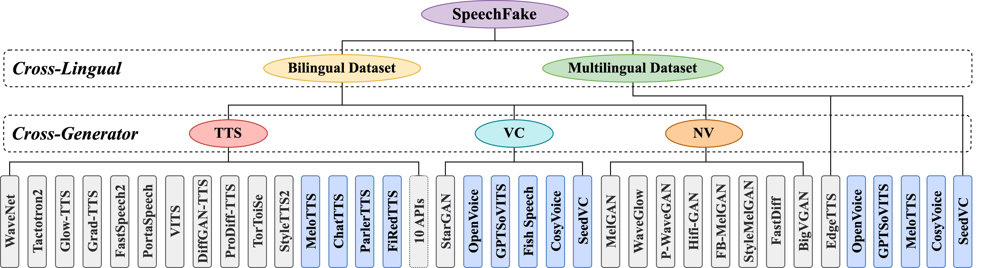

# **SpeechFake**: A Large-Scale Multilingual Speech Deepfake Dataset Incorporating Cutting-Edge Generation Methods

<p align="left">
  <a href="https://2025.aclweb.org/"></a>
  <a href="https://arxiv.org/abs/2507.08530"></a>
  <a href="https://www.modelscope.cn/datasets/inclusionAI/SPEECHFAKE"></a>
  <a href="https://github.com/YMLLG/SPEECHFAKE/blob/main/LICENSE"></a>
</p>


## Introduction

**SpeechFake** is a large-scale multilingual dataset for speech deepfake detection, featuring over 3 million fake samples across 46 languages. Generated using 30 diverse open-source models spanning text-to-speech (TTS), voice conversion or clone (VC), and neural vocoder (NV) methods, it offers rich metadata and strong coverage of modern generation techniques, enabling robust and generalizable detection research.



## Dataset Download

### Modelscope

You can download the dataset through [ModelScope](https://www.modelscope.cn/datasets/inclusionAI/SPEECHFAKE). For details, see Download [Instructions](https://www.modelscope.cn/docs/Download%20Dataset).

Before downloading, install ModelScope first by using the following command

```bash
pip install modelscope
```

#### Command Line Download

Download the full dataset repo

```bash
modelscope download --dataset inclusionAI/SPEECHFAKE
```

Download a single file to a specified local folder (using the example of downloading README.md to the "dir" directory in the current path)

```bash
modelscope download --dataset inclusionAI/SPEECHFAKE README.md --local_dir ./dir
```

For more extensive command line download options, please refer to [the specific documentation](https://www.modelscope.cn/docs/datasets/download#3-使用命令行工具下载数据集文件)

#### SDK Download

```python
# Dataset Download
from modelscope.msdatasets import MsDataset
ds =  MsDataset.load('inclusionAI/SPEECHFAKE')
# You can configure subset_name and split as needed, refer to the "Quick Use" sample code
```

#### Git Download

Please ensure that LFS has been installed correctly.

```bash
git lfs install
git clone https://www.modelscope.cn/datasets/inclusionAI/SPEECHFAKE.git
```

## Acknowledgement

**SpeechFake** is constructed using a combination of publicly available speech datasets and open-source speech generation methods.

### **Real Speech Datasets**

| Dataset | Language(s) | License | Source |
|---|---|---|---|
| VCTK | En | CC-BY-4.0 | https://datashare.ed.ac.uk/handle/10283/3443 |
| LibriTTS | En | CC-BY-4.0 | https://www.openslr.org/60/ |
| AISHELL-1 | Zh | Apache-2.0 | https://openslr.org/33 |
| AISHELL-3 | Zh | Apache-2.0 | https://openslr.org/93 |
| CommonVoice | 46 Langs | CC-0 | https://commonvoice.mozilla.org/en/datasets |

### **Speech Generation Methods**

| No. | Method | Type | License | Link |
| ---- | ---------------- | ------ | ------- | ----------------------------------------------- |
| 1 | MelGAN | NV | MIT | https://github.com/kan-bayashi/ParallelWaveGAN |
| 2 | WaveGlow | NV | BSD-3-Clause | https://github.com/NVIDIA/waveglow |
| 3 | ParallelWaveGAN | NV | MIT | https://github.com/kan-bayashi/ParallelWaveGAN |
| 4 | HiFi-GAN | NV | MIT | https://github.com/kan-bayashi/ParallelWaveGAN |
| 5 | FullbandMelGAN | NV | MIT | https://github.com/kan-bayashi/ParallelWaveGAN |
| 6 | StyleMelGAN | NV | MIT | https://github.com/kan-bayashi/ParallelWaveGAN |
| 7 | FastDiff | NV | MIT | https://github.com/Rongjiehuang/FastDiff |
| 8 | BigVGAN | NV | MIT | https://github.com/NVIDIA/BigVGAN |
| 9 | WaveNet | TTS | MIT | https://github.com/r9y9/wavenet_vocoder |
| 10 | Tactotron2 | TTS | MIT | https://github.com/NVIDIA/tacotron2 |
| 11 | GlowTTS | TTS | MIT | https://github.com/jaywalnut310/glow-tts |
| 12 | GradTTS | TTS | MIT | https://github.com/huawei-noah/Speech-Backbones |
| 13 | FastSpeech2 | TTS | MIT | https://github.com/ming024/FastSpeech2 |
| 14 | PortaSpeech | TTS | MIT | https://github.com/keonlee9420/PortaSpeech |
| 15 | VITS | TTS | MIT | https://github.com/jaywalnut310/vits/tree/main |
| 16 | StarGAN-VC | VC | MIT | https://github.com/yl4579/StarGANv2-VC |
| 17 | DiffGAN-TTS | TTS | MIT | https://github.com/keonlee9420/DiffGAN-TTS |
| 18 | ProDiff-TTS | TTS | MIT | https://github.com/Rongjiehuang/ProDiff |
| 19 | EdgeTTS | TTS | GPL-3.0 | https://github.com/rany2/edge-tts.git |
| 20 | TorToiSe | TTS | Apache-2.0 | https://github.com/neonbjb/tortoise-tts |
| 21 | StyleTTS2 | TTS | MIT | https://github.com/yl4579/StyleTTS2 |
| 22 | OpenVoice | VC | MIT | https://github.com/myshell-ai/OpenVoice |
| 23 | GPTSoVITS | VC | MIT | https://github.com/RVC-Boss/GPT-SoVITS |
| 24 | Fish Speech | TTS/VC | Apache-2.0 | https://github.com/fishaudio/fish-speech |
| 25 | MeloTTS | TTS | MIT | https://github.com/myshell-ai/MeloTTS |
| 26 | ChatTTS | TTS | GPL-3.0 | https://github.com/2noise/ChatTTS |
| 27 | CosyVoice | TTS/VC | Apache-2.0 | https://github.com/FunAudioLLM/CosyVoice |
| 28 | Parler-TTS | TTS | Apache-2.0 | https://github.com/huggingface/parler-tts |
| 29 | FireRedTTS | TTS | MPL-2.0 | https://github.com/FireRedTeam/FireRedTTS |
| 30 | Seed-VC | VC | GPL-3.0 | https://github.com/Plachtaa/seed-vc |


## Citation

If you use this dataset in your work, please cite the following paper:

```
@inproceedings{huang2025speechfake,
  title={SpeechFake: A Large-Scale Multilingual Speech Deepfake Dataset Incorporating Cutting-Edge Generation Methods},
  author={Huang, Wen and Gu, Yanmei and Wang, Zhiming and Zhu, Huijia and Qian, Yanmin},
  booktitle={Proceedings of the 63rd Annual Meeting of the Association for Computational Linguistics (Volume 1: Long Papers)},
  pages={9985--9998},
  year={2025}
}
```


